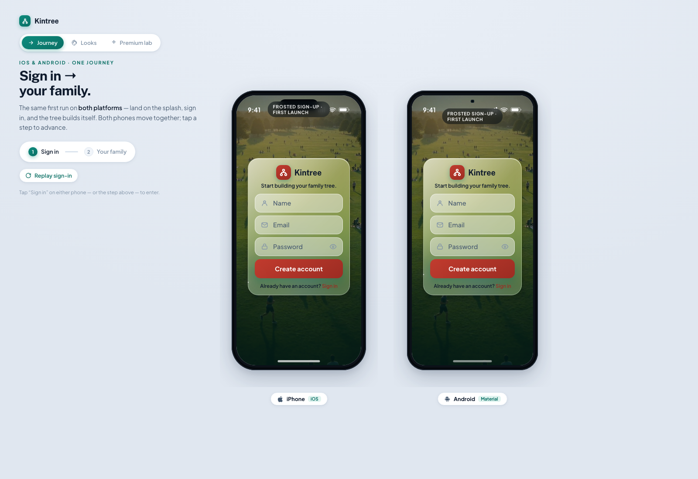
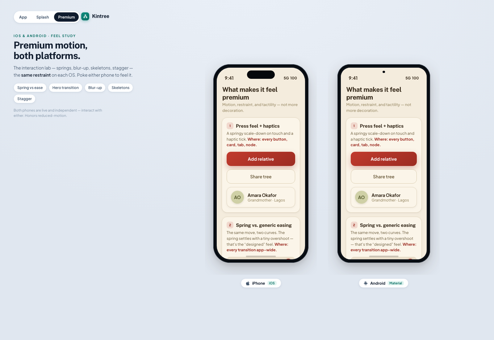
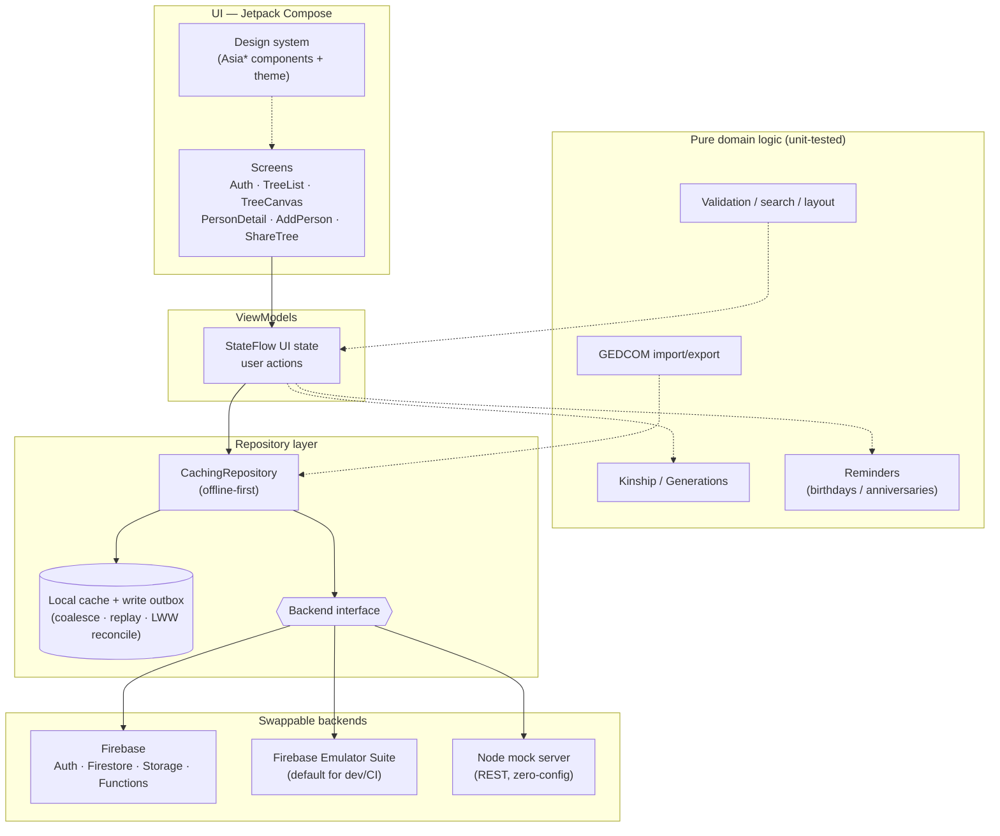

# Kintree — Family Tree App

**A native Android app for building and sharing a family tree across generations — offline-first, with real-time sync.**

> 🔒 **Source is private — available for walkthrough on request.**

---

## Screenshots

> 🎨 The images below are **high-fidelity design prototypes** of the Kintree UI — the native app's intended look and one-flow-across-platforms design — rendered iOS alongside Android. (Live in-app captures coming once the public build config is wired up.)

**Onboarding — "sign in → your family"** (iOS & Android, one flow):

**Relatives & premium interactions** — relative cards, add-relative / share-tree actions, motion study:

---

## Overview

Family history is collaborative and long-lived: several relatives add to the same tree,
often from different devices, sometimes with no signal at the family reunion where the
stories actually come out. That makes two things non-negotiable — **edits must work
offline** and **changes must converge** when everyone reconnects, without clobbering each
other.

Kintree is a native **Android app (Kotlin / Jetpack Compose)** that does exactly that. You
sign up, create a tree, add people (names, dates, places, notes, photos), view the tree as
a generational layout, tap a person to see how they're related, and share a tree with
another family member by email so you can both edit it — with live-ish updates across
devices. Under the hood it's **offline-first**: every edit lands in a local cache and a
write outbox first, then reconciles with the backend using last-write-wins. The backend is
**swappable** — a zero-config Node mock server, the Firebase Local Emulator Suite, or real
Firebase in the cloud — all behind one repository interface. *(A parallel SwiftUI iOS app
shares the same architecture and serves as a near 1:1 reference; this write-up focuses on
Android.)*

## Key features

- **Auth & trees.** Email/password sign up and sign in; create and manage family trees.
- **Rich person records.** Given/family/maiden names, gender, partial or full birth/death
  dates and places, notes, and a photo.
- **Generational tree view.** A pan/zoom canvas with connecting lines and a focus mode,
  alongside generation strips.
- **Relationship calculator.** Tap any two people to see how they're related — kinship is
  computed from the parent/spouse graph.
- **Life events & timeline.** Marriage, divorce, residence, education, occupation,
  immigration, military, and custom events render as a per-person timeline.
- **Sharing & collaboration.** Invite a family member by email (including invites that
  resolve when they later sign up); members co-edit the same tree.
- **Living-person privacy.** When enabled, non-owner members see living people with
  sensitive fields redacted — **enforced server-side**, not just hidden in the UI.
- **Reminders.** Upcoming birthdays (living people) and anniversaries (marriage events) for
  the next 30 days, **derived** from existing data with no new storage, surfaced via local
  notifications.
- **GEDCOM import/export.** A minimal GEDCOM 5.5.1 subset maps onto the person and
  parent/spouse graph with a stable export→import round-trip.
- **Offline-first.** A local cache + write outbox; ops coalesce, replay in order, and
  reconcile last-write-wins, flagging records changed by someone else.

## Architecture

Both the Android and iOS apps follow **MVVM with a thin service layer**: Compose Views are
pure presentation, ViewModels hold UI state and expose `StateFlow`, and a Repository layer
wraps the backend and converts DTOs ↔ domain models. The key design move is the
**swappable backend behind one repository interface** — debug builds default to the
Firebase Emulator Suite (exercising the real security rules and Cloud Functions), with a
zero-config Node REST mock server as a documented fallback, and real Firebase for
production. Wrapping all of it is a **caching repository** that gives the app its
offline-first behaviour: reads serve from a local cache, writes enqueue to an outbox, and a
reconcile step merges fresh remote snapshots with last-write-wins. Genealogy logic
(kinship, generations, GEDCOM, reminders, validation) lives in pure, separately tested
modules shared in spirit across both platforms.

## Tech stack

*From the project's actual `android/app/build.gradle.kts`.*

| Concern | Choice |
|---|---|
| Language / UI | Kotlin · Jetpack Compose (Material 3, Navigation Compose) |
| Min / target SDK | Android 8.0 (API 26) / API 34 |
| Architecture | MVVM + repository, `StateFlow`, ViewModel-Compose |
| Async | Kotlin Coroutines |
| Networking (mock/REST) | OkHttp + Moshi |
| Images | Coil |
| Background work | WorkManager (daily reminder check) |
| Backend (default) | Firebase — Auth, Firestore, Storage, Functions |
| Anti-abuse | Firebase App Check (Play Integrity in release, debug provider in debug) |
| Telemetry | Firebase Crashlytics, Analytics, Performance |
| Beta distribution | Firebase App Distribution (debug-only feedback SDK) |
| Build | Gradle (Kotlin DSL), JDK 17 toolchain |
| Tests | JUnit (unit) · Compose UI tests + Test Orchestrator (instrumented) |

## Engineering highlights

- **Offline-first without polluting the domain model.** Sync state lives entirely in a
  parallel cache + outbox structure — no extra fields on `Person`/`Tree`/`Event`. Ops on
  the same record coalesce (two edits → one update; create-then-delete → nothing), replay
  oldest-first and stop at the first failure, and a temporary `local-…` id is rewritten to
  the backend's real id once a create flushes.
- **One repository interface, three backends.** Mock REST server, Firebase emulator, and
  real Firebase all sit behind the same boundary, so the UI and ViewModels never change
  when the backend does — and CI runs against the emulator, exercising the *real* security
  rules and Cloud Functions rather than a stand-in.
- **Privacy enforced server-side.** Living-person redaction is implemented in Firestore
  security rules plus a Cloud Function that serves non-owners a redacted mirror — a direct
  read cannot retrieve protected fields, so privacy doesn't depend on the client behaving.
- **Cheap, consistent data shape.** Children are *computed* from `parentIds` rather than
  stored (no two-way consistency bugs); spouses are stored bidirectionally; marriage/
  divorce dates are first-class events. Photos live in storage; documents carry only the URL.
- **Determinism in the fiddly bits.** Reminder math uses a fixed UTC Gregorian calendar,
  skips year-only dates, clamps Feb 29 → Feb 28 in non-leap years, and treats "today" as
  zero days away — all pinned by shared test fixtures so iOS and Android agree.
- **Release safety as a build gate.** The Gradle build refuses to produce a release
  artifact unless a real backend is configured (inspecting the resolved task graph so
  aggregate entry points can't slip past), and the debug-only tester-feedback SDK is wired
  so it can never reach a Play release.
- **Operability built in.** Crashlytics, Analytics, and Performance are wired with
  per-build-type collection toggles, alongside checked-in Grafana dashboards (backend,
  client-health, cost) and a weekly automated beta-distribution workflow.

## Status

**Architecture, data layer, and core flows working end-to-end** — enough to demo, share
with family, and iterate from. Shipped: auth, tree creation, person CRUD with photos, the
visual tree canvas, kinship calculation, life-events timeline, sharing/member management,
server-side living privacy, reminders, GEDCOM import/export, and offline-first sync. The
Android build runs against the Firebase emulator and the mock server today; full real-cloud
Firebase wiring on Android (the iOS services are a near 1:1 reference to port from), push
notifications, and a crossing-minimization tree layout are tracked follow-ups. User-facing
privacy/terms/support pages are published from a separate **public** repo via GitHub Pages,
keeping this repository private.

---

[← Back to all projects](../README.md) · 🔒 Private source — [request a walkthrough](mailto:tatendaz@me.com)
