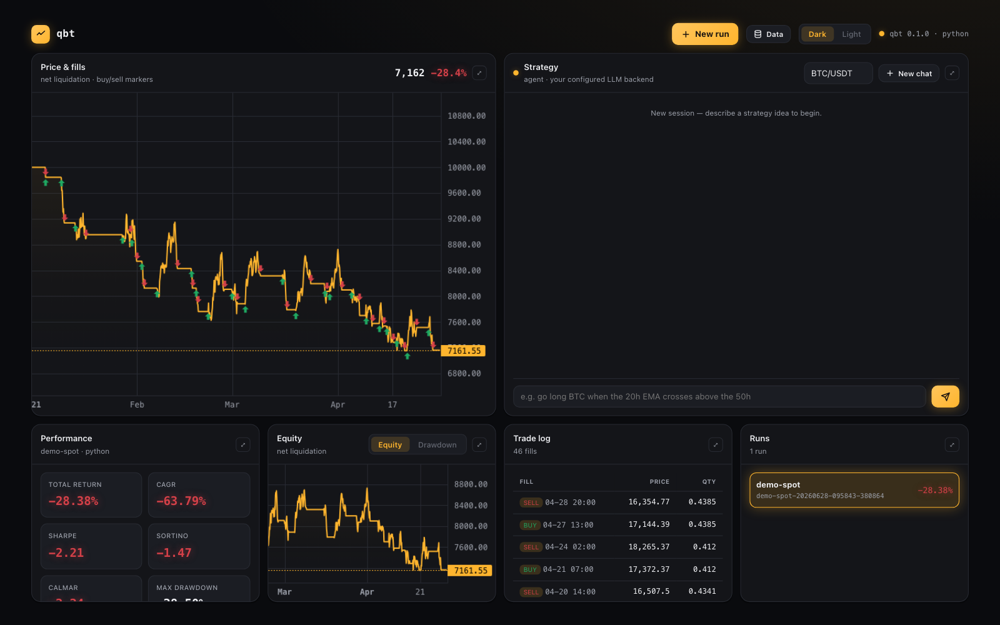
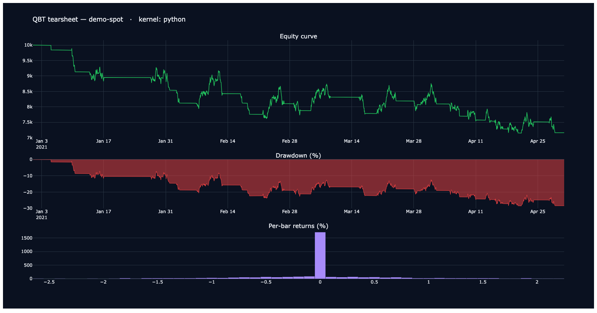
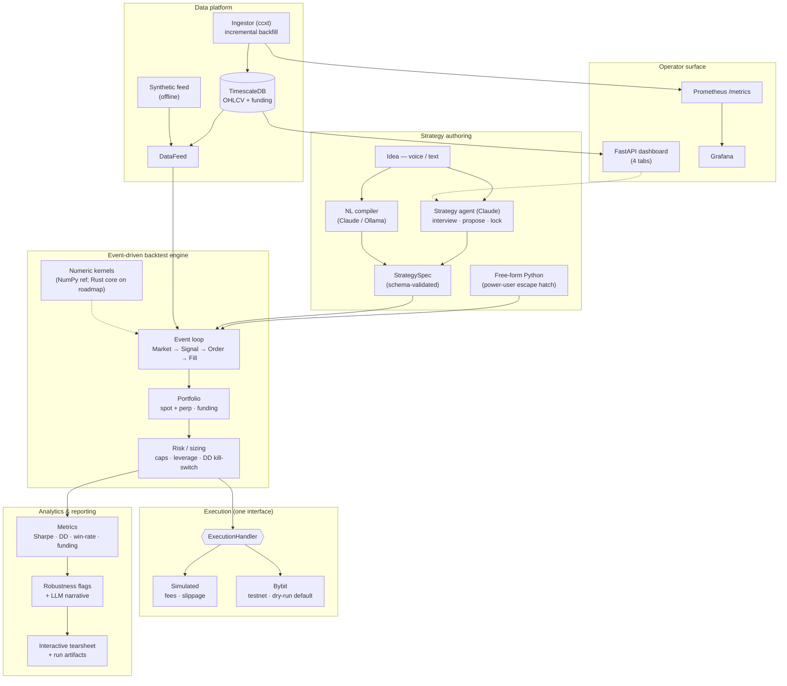

# Quant Backtest Platform (QBT)

**An event-driven crypto backtesting platform — describe a strategy in plain language, test it honestly, then run the same code live.**

> 🔒 **Source is private — available for walkthrough on request.**

> Engineering preview. Not financial advice. Trading crypto carries risk of loss.

---

## Screenshots

**Live dashboard** — candlestick price & fills, performance metrics, equity curve, and a 46-fill trade log, from a real backtest run (synthetic offline data):

**Interactive tearsheet** — equity curve, drawdown, and per-bar return distribution:

---

## Overview

Most backtests lie. They ignore trading costs, skip funding on perpetual futures, fill
orders at prices you'd never actually get, and quietly overfit to one slice of history —
so a strategy that looks brilliant in research bleeds money live.

QBT is built to close that gap. You describe a strategy in natural language (voice or
text); a language model compiles it into a **validated, inspectable spec**; the engine
backtests it against a model that accounts for **fees, funding, and slippage**; and
because live venues sit behind the *same* execution interface the simulator implements, a
strategy moves from backtest to live trading **without a rewrite**. The result of every
run is reproducible — spec, prompt, model id, metrics, and an interactive tearsheet are
all written to disk.

It runs as a single-user platform today (`docker compose up` brings up the data tier and
dashboard), architected so the jump to a scaled, multi-user deployment is a migration
rather than a rewrite.

## Key features

- **Natural-language strategy authoring.** Describe a strategy in English; an LLM
  (Claude, or a local/cloud Ollama model) compiles it to a schema-validated `StrategySpec`,
  echoes it back for confirmation, and backtests it.
- **Interactive strategy agent.** A conversational front door that interviews you,
  proposes a spec, runs a quick backtest preview with robustness notes, iterates, and
  **locks** the agreed strategy for reproducibility.
- **Honest backtest engine.** An event-driven loop (Market → Signal → Order → Fill) with
  spot *and* perpetual-futures accounting, including funding, plus simulated fees and
  slippage.
- **Risk controls.** Position caps, leverage limits, and a drawdown kill-switch.
- **Real market-data pipeline.** A scheduled ingestor pulls OHLCV and funding from
  exchange public endpoints (via ccxt) into TimescaleDB; backtests read bars straight from
  the store. Offline? A synthetic feed seeds generated data with no network.
- **Analytics & reporting.** Sharpe, drawdown, win-rate, funding-aware metrics, plus
  rule-based robustness flags and an optional LLM narrative — rendered as an interactive
  HTML tearsheet (equity, drawdown, trades) alongside machine-readable run artifacts.
- **Live execution path.** A Bybit handler implements the same interface as the simulator
  — **testnet + dry-run by default**, with an order-size cap and idempotent client IDs.
- **Web dashboard.** A FastAPI gateway + browser UI as the product surface, with
  Prometheus metrics and Grafana dashboards wired up by default.

## Architecture

QBT is organised around a single **event-driven core** and a set of swappable interfaces.
Strategy input (NL, spec, or free-form Python) compiles to a validated `StrategySpec` that
drives the engine. The engine consumes a `DataFeed` (synthetic or TimescaleDB-backed),
emits the event chain through a `Portfolio` (spot/perp accounting + funding) and risk
sizing, and routes orders through an `ExecutionHandler` — the *same* interface used by
both the simulator and the live Bybit venue. Output flows to analytics and an HTML
tearsheet. A separate data platform (ingestor → TimescaleDB) keeps bars fresh, and a
FastAPI dashboard plus Prometheus/Grafana provide the operator surface.

## Tech stack

*From the project's actual `pyproject.toml` and compose file.*

| Concern | Choice |
|---|---|
| Language | Python 3.11+ |
| Core data / numerics | NumPy, Polars, Pydantic |
| CLI / UX | Typer, Rich |
| Charting / tearsheet | Plotly |
| Market data | ccxt, httpx |
| Time-series store | TimescaleDB (PostgreSQL 17) |
| Web dashboard | FastAPI, Uvicorn |
| NL strategy authoring | Anthropic (Claude), Ollama (local/cloud) |
| Live auth (pre-flight) | signed REST — Bybit V5 (RSA), Binance (HMAC) |
| Telemetry | Prometheus client; Grafana dashboards |
| Packaging / tooling | uv, hatchling, pytest, ruff, mypy, maturin |
| Containers | Docker / Docker Compose |

## Engineering highlights

- **One execution interface, many venues.** The simulator and the live Bybit handler
  implement the same `ExecutionHandler`, so a strategy crosses from backtest to live
  unchanged — the single decision that makes "test what you trade" real.
- **Reproducible by construction.** Each locked strategy persists its spec, the prompt,
  the model id, metrics, and the transcript to a timestamped run directory, so any result
  can be regenerated and audited.
- **Exchange identity is part of the key.** OHLCV from different exchanges is never merged
  — the series key is `(exchange, symbol, freq, ts)`, threaded through the schema and
  ingestor. Binance `BTC/USDT` and Bybit `BTC/USDT` are distinct series, because their
  prices, volumes, and funding genuinely differ; averaging them would corrupt both.
- **Seed-then-sync data strategy.** Live kline APIs are rate-limited and paginate at
  ≤1000 candles, so bulk historical backfill comes from exchange public archives while an
  idempotent (`ON CONFLICT … DO UPDATE`) upsert lets bulk and live ingestion overlap
  safely.
- **Safe-by-default live trading.** The live path is testnet + dry-run by default, with an
  order-size cap and idempotent client IDs; real-funds trading is explicitly gated on the
  roadmap behind the safety-rails work (max-notional, global kill-switch, secrets in a
  manager).
- **Designed to scale out.** The dashboard is stateless and 12-factor; run artifacts can
  move to shared/object storage and the service can run as N replicas behind a load
  balancer — so the path to k8s/AWS is a migration, not a rewrite.
- **Pluggable performance.** Hot numeric paths run on a NumPy reference kernel today,
  behind a boundary that lets an optional compiled (Rust/PyO3) core drop in later without
  touching strategy code.

## Status

The **backtest core** (event-driven engine, spot + perp + funding, analytics, tearsheet,
structured-spec strategies), **natural-language authoring**, the **interactive strategy
agent**, the **TimescaleDB data pipeline**, **Bybit testnet pre-flight**, and the
**FastAPI dashboard + Prometheus/Grafana** all run today. Sequenced on the roadmap —
each behind interfaces the core already uses: Bybit **live** trading (real funds, gated),
Uniswap / L2 execution, a strategy library and saved-chat history, a profitability
iteration loop, and the scale-out tier (Redis, Kafka, AWS/k8s) plus the optional Rust
kernel.

---

[← Back to all projects](../README.md) · 🔒 Private source — [request a walkthrough](mailto:tatendaz@me.com)
