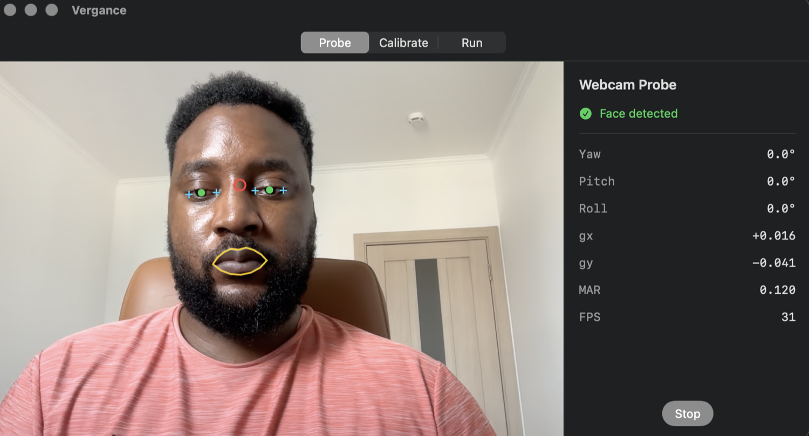
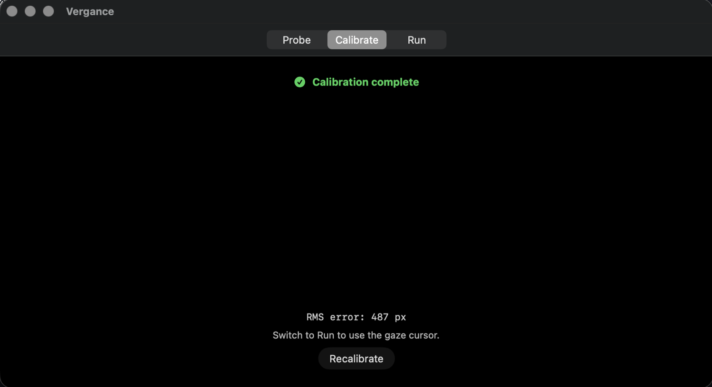
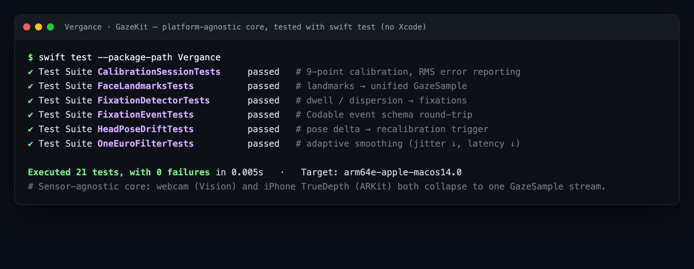
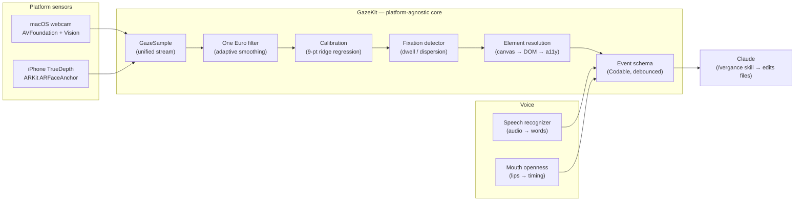

# Vergance — Gaze + Voice for Claude

**Look at something on screen, speak, and your intent — resolved to *what you were looking at* — is delivered to Claude.** Gaze supplies the deixis ("make **this** bigger") that voice alone can't.

> 🌐 **Open source — [github.com/Tatendaz/Vergance](https://github.com/Tatendaz/Vergance)** · Swift · Apache-2.0. Status: pre-alpha; the `GazeKit` core is built and unit-tested, the macOS app is in active development.

## Screenshots

**Live webcam probe — gaze & face tracking.** Per-eye landmarks, the resolved gaze point, mouth-openness (MAR), and head pose (yaw / pitch / roll) at ~30 FPS — all computed on-device:

**9-point calibration with RMS-error reporting** — the app reports calibration error in pixels, so an agent knows how much to trust spatial claims (region-level by design on a webcam):

**GazeKit core — 21 tests passing**, building and testing with plain `swift test` (no Xcode):

## Overview

Vergance is a desktop tool where the camera watches your eyes and mouth. You look at a UI element, say a command, and it emits a small, semantic event — *"the user looked at `cta-primary` for 620 ms while saying 'make this bigger'"* — that an agent like Claude can act on. **Raw camera frames never leave the device; only semantic events do.**

Two product surfaces fall out of the same capture layer:

- **Live pointer** — gaze + voice → Claude in real time, delivered as a Claude Code skill (`/vergance`) that streams gaze-resolved intent into your agent session, where it edits project files.
- **Post-hoc heatmap** — record a session and analyse where attention went (UX research).

It sets an **honest accuracy bar**: webcam v1 is region-level (reliable 2×2 quadrant; 3×3 with a still head and good light) — enough to drive the interaction, not to distinguish adjacent buttons; an iPhone TrueDepth path (v2) adds real gaze vectors + depth.

## Key features

- **Sensor-agnostic core.** Every sensor collapses to the same `GazeSample`, so the webcam and the iPhone are interchangeable and can run side-by-side.
- **Calibration** — 9-point routine, quadratic least-squares with ridge regularization, reporting **RMS error in pixels** so the agent knows how much to trust spatial claims.
- **One Euro filter** — adaptive smoothing (low latency on saccades, heavy smoothing on fixations) instead of a fixed EMA.
- **Fixation detection** — dwell / dispersion detector that turns the raw gaze stream into discrete fixations.
- **Element resolution** — staged surfaces: own canvas → browser DOM → Accessibility API.
- **Claude-facing event schema** — debounced, element-resolved `Codable` events (`session_start`, `fixation`, `utterance`, `session_summary`) rather than raw 60 Hz samples.
- **Drift handling** — head pose feeds the feature vector; a large pose delta from the calibration baseline prompts a recalibration.

## Architecture

Two platform sensors collapse to one **sensor-agnostic Swift core** (`GazeKit`), which turns a noisy gaze stream into clean, element-resolved semantic events for Claude. Voice is fused in: audio for *words* (speech recognizer), mouth-openness for *timing* (voice activity / emphasis).

## Tech stack

| Concern | Choice |
|---|---|
| Language | Swift 5.9 |
| Platforms | macOS 14+ · iOS 17+ |
| Core | `GazeKit` — Swift Package (no Xcode needed to build/test) |
| Webcam sensor | AVFoundation + Vision (face landmarks) |
| Phone sensor | ARKit TrueDepth (ARFaceAnchor) |
| Voice | Speech recognizer + mouth-openness VAD |
| Delivery | Claude Code skill (`/vergance`) |
| Quality | XCTest (21 tests) · GitHub Actions CI · Apache-2.0 |

## Status

`GazeKit` core is implemented and unit-tested (21 tests). The **macOS app** (webcam sensor, red-dot calibration UI, live landmark/gaze overlay) is in active development; an **iOS companion** (TrueDepth → network stream) is scaffolded. `ROADMAP.md` in the repo is the living spec. Open source — contributions and feedback welcome.

---

[← Back to all projects](../README.md) · 🌐 [View the code on GitHub](https://github.com/Tatendaz/Vergance)
